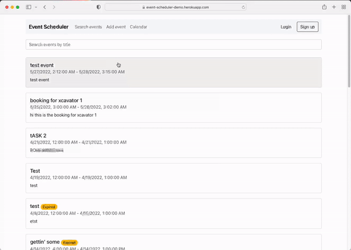
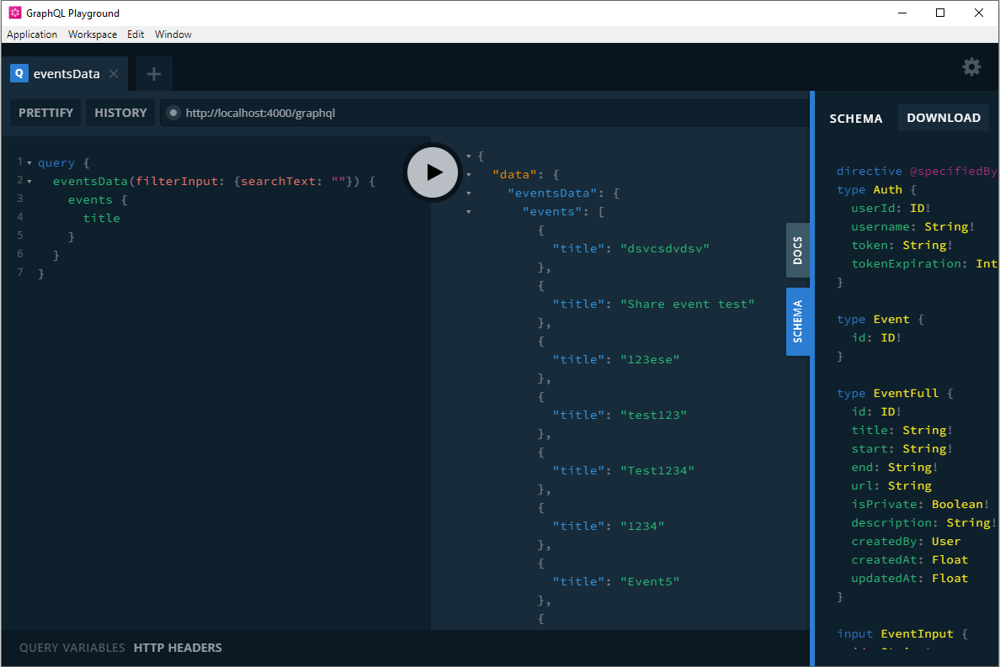

# React Event Scheduler App
[License: MIT]

This project was bootstrapped with [Create React App](https://github.com/facebook/create-react-app).

Event Scheduler is a React app that allows users to create events. An event can be anything, such as a sport event, team meeting, party announcement, personal advertisement, etc. An event consists of title, start and end date/time, and description.
All events are public by default (visible to everyone). They can also be private (only visible to you) by checking the private checkbox.

### [Demo](https://react-event-scheduler.vercel.app/) :movie_camera:

## Tech Stack

### Frontend

- React (react hooks)

### Backend

- NodeJS with Express
- MongoDB with mongoose

### This project implements Apollo advanced caching mechanisms for better performance (posting or fetching data from the serve is only performed when needed)

---

Note that `graphql` schemas are generated using [GraphQL Code Generator](https://www.graphql-code-generator.com/docs/getting-started). This means that if you make any changes to the schema (server/graphql/schema/index.ts), make sure that the `.graphql` files in the frontend are also updated accordingly. Next, run `yarn codegen` to re-generate the gueries and mutations on the frontend (Note: before you do this, make sure the server is up and running by either running `yarn start` or `yarn start:server`)

[GraphQL Playground](https://github.com/graphql/graphql-playground) is a powerful GraphQL IDE enabling better (local) development workflows. It helps test your schemas locally. See image below:

## Run app locally

> Make sure MongoDB is up and running

In the project directory, run `yarn`, then:

### `yarn start`

Runs the backend and frontend apps simultaneously in the development mode.\

> Or if you prefer running the apps separately by running `start:web` and `start:server` in separate terminals.

Open [http://localhost:3000](http://localhost:3000) to view it in the browser.

The page will reload if you make changes.\
You will also see any lint errors in the console.

## Current functionality

- User signup and login
- Create, update and delete events
- Search & pagination
- Make events as private (only visible to creators)
- Session expiry warning (displayed when being idle for 3 minutes after logging in)
